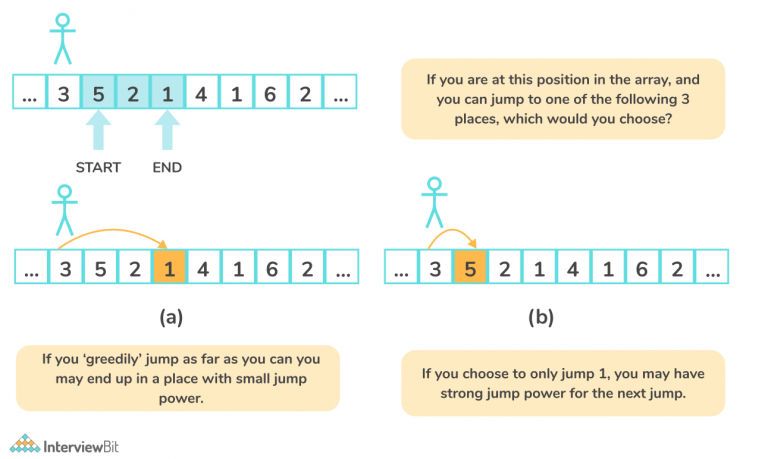

# 🚀 Minimum Number of Jumps to Reach the End of Array (Python)

This project implements an efficient solution in Python to solve the classic **"Minimum Number of Jumps to Reach the End of Array"** problem.

---

## 🧠 Problem Statement

Given an array of non-negative integers, where each element represents the maximum number of steps you can jump forward from that element, determine the **minimum number of jumps** required to reach the last index starting from the first index.

If it's not possible to reach the end, return `-1`.

---

## 🔍 Example

```python
Input: arr = [2, 3, 1, 1, 4]
Output: 2
Explanation: Jump 1 step from index 0 to 1, then 3 steps to the last index.
```

---

## 🛠️ Approach

This project uses a **greedy algorithm** to solve the problem in **O(n)** time and **O(1)** space.

### Steps:

1. Initialize `maxReach`, `steps`, and `jumps`.
2. Traverse the array while updating:
   - The furthest index reachable so far.
   - The number of steps remaining in the current jump.
   - The number of jumps when steps run out.
3. Return the total number of jumps needed.

---


## 📁 File Structure

```
📦 minimum-jumps/
 ┣ 📄 minimum_jumps.py      # Main logic
 ┣ 📄 test_cases.py         # Example test cases
 ┗ 📄 README.md             # Project documentation
```

---

## 🧪 Sample Code

```python
def min_jumps(arr):
    if len(arr) <= 1:
        return 0
    if arr[0] == 0:
        return -1

    maxReach = arr[0]
    steps = arr[0]
    jumps = 1

    for i in range(1, len(arr)):
        if i == len(arr) - 1:
            return jumps

        maxReach = max(maxReach, i + arr[i])
        steps -= 1

        if steps == 0:
            jumps += 1
            if i >= maxReach:
                return -1
            steps = maxReach - i

    return -1
```

---

## 🧪 Running Tests

You can run test cases from `test_cases.py` using:

```bash
python test_cases.py
```

---

## 💡 Key Concepts

- Greedy algorithms  
- Array traversal  
- Optimization  

---

## 🤔 When to Use

This algorithm is especially useful in:
- Game level design
- Optimal pathfinding problems
- Competitive programming

---

## 🔗 Related Problems

- Jump Game I & II (LeetCode)
- BFS-based pathfinding
- Dynamic programming optimizations
```
